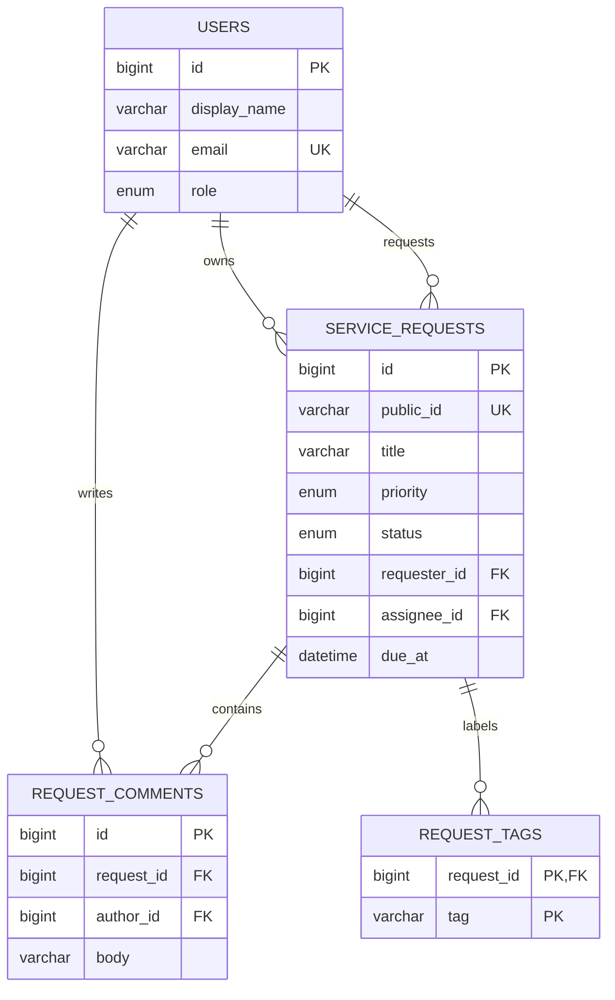

# Entity relationship diagram

```mermaid
erDiagram
  USERS ||--o{ SERVICE_REQUESTS : requests
  USERS ||--o{ SERVICE_REQUESTS : owns
  SERVICE_REQUESTS ||--o{ REQUEST_COMMENTS : contains
  USERS ||--o{ REQUEST_COMMENTS : writes
  SERVICE_REQUESTS ||--o{ REQUEST_TAGS : labels

  USERS {
    bigint id PK
    varchar display_name
    varchar email UK
    enum role
  }
  SERVICE_REQUESTS {
    bigint id PK
    varchar public_id UK
    varchar title
    enum priority
    enum status
    bigint requester_id FK
    bigint assignee_id FK
    datetime due_at
  }
  REQUEST_COMMENTS {
    bigint id PK
    bigint request_id FK
    bigint author_id FK
    varchar body
  }
  REQUEST_TAGS {
    bigint request_id PK,FK
    varchar tag PK
  }
```
